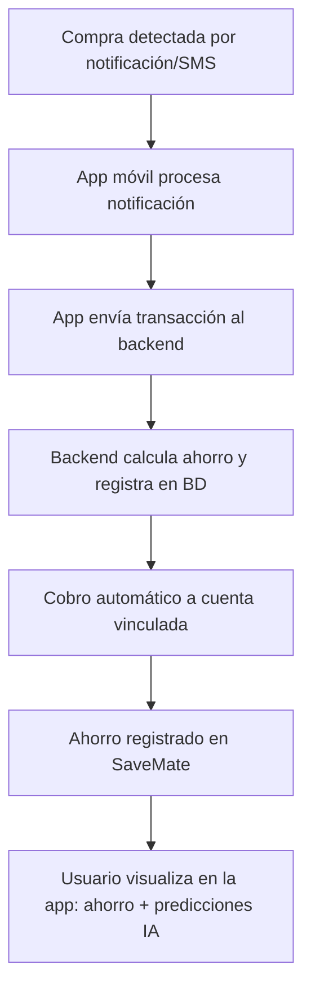

# 💰 SaveMate – Tu asistente de ahorro inteligente

**SaveMate** es una **app móvil (Android/iOS)** que transforma los **gastos diarios pequeños** (☕ cafés, 🍫 snacks, 🚌 transporte) en **ahorro automático** mediante redondeo o porcentaje configurable.

La app detecta las transacciones a partir de **notificaciones y SMS bancarios**, procesa el redondeo o porcentaje definido, y realiza un **cobro automático** a la cuenta de origen para apartar el ahorro en una **alcancía digital dentro de SaveMate**.

Además, incorpora **IA generativa** que predice gastos probables y sugiere configuraciones óptimas para que el usuario alcance sus metas más rápido.

---

## 🔎 Problema identificado
- ❌ Los usuarios no logran ahorrar porque no llevan control de los **gastos pequeños**.
- ❌ El dinero “desaparece” al final del mes sin claridad en qué se gastó.
- ❌ Ahorrar manualmente requiere disciplina y constancia, algo difícil de mantener.

---

## 💡 Propuesta de valor
- 💵 **Ahorro automático inteligente**, ligado directamente al consumo real ⚡ *(MVP)*
- 🎯 **Metas personalizadas**, que el usuario puede definir ⚡ *(MVP)*
- 🤖 **IA predictiva y generativa** para anticipar gastos y recomendar ajustes ⚡ *(MVP)*
- 👥 **Metas colaborativas** (futuro)
- 🎮 **Gamificación y logros** (futuro)
- 📚 **Educación financiera ligera** (futuro)

---

## ⚙️ Mecánica de funcionamiento

1. **Detección de transacción** ⚡ *(MVP)*
2. **Cálculo del ahorro** ⚡ *(MVP)*
3. **Cobro automático** ⚡ *(MVP)*
4. **Escenarios de saldo insuficiente** ⚡ *(MVP)*
    - Opción A: No se ahorra
    - Opción B: Se registra como pendiente y se descuenta en la próxima recarga
    - Opción C: Respeta el saldo mínimo seguro definido por el usuario
5. **Visualización de ahorro y gastos** ⚡ *(MVP)*
6. **IA predictiva y generativa** ⚡ *(MVP)*

📌 **Ejemplo práctico de redondeo**
- Pago realizado: $15.200
- Redondeo al múltiplo superior: $16.000
- Ahorro generado: $800

---

## 💰 Modelo de monetización
- Comisión del **2.5% del total ahorrado al final de cada mes** ⚡ *(MVP)*
- Ejemplo: Si un usuario ahorra $200.000, SaveMate cobra $5.000

---

## 🆕 Funcionalidades destacadas

### ⚡ MVP – Primera versión
- Ahorro automático (redondeo o porcentaje)
- Manejo de saldo insuficiente (opciones A, B, C)
- IA predictiva y generativa
- Visualización de gastos y ahorro acumulado
- Monetización por comisión mensual

### 🚀 Futuras mejoras
- 🎮 Sistema de **recompensas y logros por ahorro**
- 👥 Modo colaborativo: metas de ahorro en grupo
- 📚 Educación financiera ligera automatizada

---

## 🏗️ Arquitectura del proyecto

```
/savemate-backend     -> API REST en Spring Boot (gestión de datos y lógica de negocio, MySQL)
/savemate-mobile      -> App móvil Flutter (UI Android/iOS + integración con IA)
```

### 📂 Estructura del backend (Java + Spring Boot)

```bash
src/main/java/safemate/
│
├── config/                  
│   └── SecurityConfig.java ⚡                 # Configuración de seguridad y autenticación
│
├── controller/              
│   ├── UserController.java ⚡                  # Endpoints de usuarios
│   ├── TransactionController.java ⚡           # Endpoints de transacciones
│   ├── SavingController.java ⚡                # Endpoints de metas de ahorro
│   └── AIController.java ⚡                    # Endpoints de IA predictiva
│
├── dto/                     
│   ├── UserDTO.java ⚡
│   ├── TransactionDTO.java ⚡
│   ├── SavingDTO.java ⚡
│   └── AIRecommendationDTO.java ⚡
│
├── model/                   
│   ├── User.java ⚡
│   ├── Transaction.java ⚡
│   ├── SavingGoal.java ⚡
│   └── AIRecommendation.java ⚡
│
├── repository/              
│   ├── UserRepository.java ⚡
│   ├── TransactionRepository.java ⚡
│   ├── SavingRepository.java ⚡
│   └── AIRecommendationRepository.java ⚡      # Repositorio para recomendaciones de IA
│
├── service/                 
│   ├── UserService.java ⚡
│   ├── TransactionService.java ⚡
│   ├── SavingService.java ⚡
│   └── AIService.java ⚡
│
├── util/                    
│   ├── RoundingUtils.java ⚡
│   └── NotificationParserUtils.java ⚡
│
└── SaveMateApplication.java ⚡                 # Clase principal

src/main/resources/
│
├── application.properties ⚡                   # Configuración de MySQL y Spring Boot
├── logback-spring.xml ⚡                       # Configuración de logs
└── otros archivos de configuración...
```

### 📱 App móvil (Flutter)

```bash
lib/
│
├── main.dart ⚡
├── screens/
│   ├── login_screen.dart ⚡
│   ├── home_screen.dart ⚡
│   ├── transactions_screen.dart ⚡
│   ├── savings_screen.dart ⚡
│   └── ai_recommendations.dart ⚡
│
├── widgets/
│   ├── transaction_card.dart ⚡
│   ├── saving_goal_card.dart ⚡
│   └── ai_tip_card.dart ⚡
│
├── services/
│   ├── api_service.dart ⚡
│   ├── notification_service.dart ⚡
│   └── ai_service.dart ⚡
│
└── models/
    ├── user.dart ⚡
    ├── transaction.dart ⚡
    ├── saving.dart ⚡
    └── ai_recommendation.dart ⚡
```

---

## 📊 Diagrama de flujo simplificado



---

## 🛠️ Tecnologías utilizadas

### Backend
- ☕ Java 17
- 🌱 Spring Boot 3
- 🗂️ Spring Data JPA
- 🔐 Spring Security
- 🛢️ MySQL

### Móvil
- 📱 Flutter (Android/iOS)
- 🤖 TensorFlow Lite *(IA en dispositivo)*
- 🔗 HTTP/Dio *(consumo de API REST)*

---

## ⚡ Instalación y ejecución local

### 📥 Clonar repositorio
```bash
git clone https://github.com/tuusuario/savemate.git
```

### ▶️ Ejecutar el backend
```bash
cd savemate-backend
mvn spring-boot:run
```

### ▶️ Ejecutar la app móvil
```bash
cd savemate-mobile
flutter pub get
flutter run
```

---

## 📡 Endpoints principales

### 👥 Usuarios
- `POST /api/users` → Crear usuario
- `GET /api/users/{id}` → Obtener usuario por ID

### 🧾 Transacciones
- `POST /api/transactions` → Registrar gasto/ingreso
- `GET /api/transactions/user/{id}` → Listar transacciones de un usuario

### 🎯 Metas de ahorro
- `POST /api/savings` → Crear meta de ahorro
- `GET /api/savings/user/{id}` → Listar metas de un usuario

---

## 👨‍💻 Equipo
- Manuel Suárez
- Yeltzyn Sierra
- Cristian Zeballos
