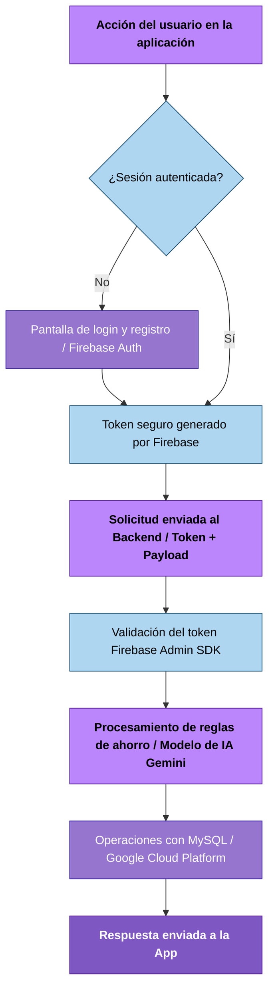

# 💰 SaveMate – Tu asistente de ahorro inteligente (V3.0 - MVP)

SaveMate es una app móvil (Android/iOS) que transforma los gastos diarios pequeños (☕ cafés, 🍫 snacks, 🚌 transporte) en **ahorro automático** mediante reglas configurables de **redondeo** o **porcentaje**.

En esta versión **MVP V3.0**, la solución está totalmente desplegada en **Google Cloud Platform (GCP)**, cuenta con autenticación segura mediante **Firebase**, e incorpora **IA generativa basada en Gemini AI**, encargada de predecir gastos probables y sugerir configuraciones óptimas para que el usuario alcance sus metas de ahorro más rápido.

---

## 🔎 Problema identificado

- ❌ Los usuarios no logran ahorrar porque no controlan los gastos pequeños.
- ❌ El dinero “desaparece” sin claridad en qué se gastó.
- ❌ Ahorrar manualmente exige disciplina difícil de mantener.

---

## 💡 Propuesta de valor

### 🟩 Funcionalidades incluidas en MVP V3.0

- 💵 **Ahorro automático inteligente** basado en reglas configurables.
- ☁️ **Infraestructura Cloud:** Backend + BD alojados en GCP Compute Engine.
- 🔐 **Seguridad avanzada:** Autenticación con Firebase Auth.
- 🎯 **Metas personalizadas de ahorro.**
- 🤖 **IA predictiva y generativa**: anticipa gastos y recomienda ajustes.
- 📊 **Dashboard con ahorro acumulado y desglose de gastos.**

### 🟧 Futuro (post-MVP)

- 👥 Metas colaborativas.
- 🎮 Gamificación y sistema de logros.
- 📚 Educación financiera ligera dentro de la app.

---

## ⚙️ Mecánica de funcionamiento (MVP V3.0)

### 1️⃣ Registro y autenticación segura
Implementado con **Firebase Authentication**.

### 2️⃣ Gestión de transacciones
Registro manual de movimientos financieros.

### 3️⃣ Cálculo del ahorro
Basado en dos métodos:
- 🔸 Redondeo
- 🔸 Porcentaje del gasto

### 4️⃣ Simulación de cobro automático (MVP)

Escenarios cuando el saldo es insuficiente:

- **Opción A:** No se ahorra.
- **Opción B:** Se registra como “pendiente”.
- **Opción C:** Respeta “saldo mínimo seguro”.

### 5️⃣ Visualización del ahorro
Dashboard en tiempo real con:

- Ahorro acumulado
- Gastos por categoría
- Tendencias del mes

### 6️⃣ IA predictiva y generativa
Sugiere:

- Montos óptimos de ahorro
- Ajustes de reglas
- Riesgo de incumplimiento de metas

---

## 📌 Ejemplo práctico de redondeo

- Pago realizado: **$15.200**
- Redondeo al múltiplo superior: **$16.000**
- Ahorro generado: **$800**

---

## 💰 Modelo de monetización (MVP)

- **Comisión del 2.5%** del total ahorrado al finalizar el mes.

Ejemplo:  
Si un usuario ahorra **$200.000 → SaveMate cobra $5.000**

---

## 🆕 Estado de funcionalidades

### ⚡ **MVP – Versión 3.0 (Actual)**

- ✔️ Backend y Base de Datos en producción (GCP).
- ✔️ Autenticación con Firebase totalmente integrada.
- ✔️ Algoritmos de ahorro funcionales (redondeo/porcentaje).
- ✔️ IA generativa y predictiva activada.
- ✔️ APK móvil funcional conectada al backend.
- ✔️ Lógica de monetización implementada.

---

## 🚀 Futuras mejoras (V4.0 y posterior)

- 📨 **Lectura automática de SMS/Notificaciones** para detectar gastos reales en tiempo real.
- 🎮 **Recompensas, logros y niveles** (gamificación).
- 👥 **Metas colaborativas** entre usuarios.
- 📚 **Educación financiera automatizada** dentro de la app.

---

## 🏗️ Arquitectura del proyecto

```
/savemate-backend      -> API REST en Spring Boot (gestión de datos, lógica de negocio y seguridad)
/savemate-mobile       -> App móvil Flutter (UI Android/iOS + integración con Telephony e IA)
```

### 📂 Estructura del backend (Java + Spring Boot)

```bash
src/main/java/savemate/
│
├── config/                  
│   ├── FirebaseConfig.java ✨            # Configuración de conexión a Firebase SDK
│   ├── FirebaseTokenFilter.java ✨       # Filtro de seguridad para validar tokens de Firebase
│   ├── SecurityConfig.java ⚡            # Configuración de seguridad (WebSecurity)
│   ├── WebConfig.java ⚡                 # Configuración CORS y MVC
│   └── JpaConfig.java ⚡                 # Configuración JPA/Hibernate
│
├── controller/              
│   ├── AuthController.java ⚡            # Endpoints de autenticación (Firebase Token Verify)
│   ├── UserController.java ⚡            # Gestión de perfil de usuario
│   ├── TransactionController.java ⚡     # Gestión de transacciones
│   ├── SavingController.java ⚡          # Gestión de metas de ahorro
│   ├── AIController.java ⚡              # Endpoints de IA (Recomendaciones)
│   └── HealthController.java ⚡          # Check de estado del servicio
│
├── dto/                     
│   ├── UserDTO.java ⚡
│   ├── TransactionDTO.java ⚡
│   ├── TransactionSummaryDTO.java ⚡
│   ├── SavingDTO.java ⚡
│   ├── SavingSummaryDTO.java ⚡
│   ├── AIRecommendationDTO.java ⚡
│   └── AIRecommendationSummaryDTO.java ⚡
│
├── model/                   
│   ├── User.java ⚡                      # Entidad Usuario
│   ├── Transaction.java ⚡               # Entidad Transacción
│   ├── SavingGoal.java ⚡                # Entidad Meta de Ahorro
│   └── AIRecommendation.java ⚡          # Entidad Recomendación IA
│
├── repository/              
│   ├── UserRepository.java ⚡
│   ├── TransactionRepository.java ⚡
│   ├── SavingRepository.java ⚡
│   └── AIRecommendationRepository.java ⚡
│
├── service/                 
│   ├── UserService.java ⚡
│   ├── TransactionService.java ⚡
│   ├── SavingService.java ⚡
│   └── AIService.java ⚡                 # Lógica de negocio para IA
│
├── util/                    
│   ├── RoundingUtils.java ⚡             # Lógica de redondeo
│   └── NotificationParserUtils.java ⚡   # Parsing de SMS/Notificaciones
│
└── SaveMateApplication.java ⚡           # Clase principal (Main)

src/main/resources/
│
├── application.properties ⚡             # Configuración DB, JWT y Servidor
└── logback-spring.xml ⚡                 # Configuración de Logging
```

### 📱 App móvil (Flutter)

```bash
lib/
│
├── main.dart ⚡                          # Punto de entrada de la App
├── screens/
│   ├── login_screen.dart ⚡              # Pantalla de Inicio de Sesión
│   ├── register_screen.dart ⚡           # Pantalla de Registro
│   ├── home_screen.dart ⚡               # Dashboard principal
│   ├── transactions_screen.dart ⚡       # Historial de transacciones
│   ├── savings_screen.dart ⚡            # Gestión de metas de ahorro
│   ├── profile_screen.dart ⚡            # Perfil de usuario
│   └── ai_recommendations_screen.dart ⚡ # Pantalla de consejos de IA
│
├── widgets/
│   ├── transaction_card.dart ⚡          # Tarjeta de transacción
│   ├── saving_goal_card.dart ⚡          # Tarjeta de meta de ahorro
│   └── ai_tip_card.dart ⚡               # Tarjeta de consejo IA
│
├── services/
│   ├── api_service.dart ⚡               # Cliente HTTP base
│   ├── auth_service.dart ⚡              # Servicio de autenticación
│   └── notification_service.dart ⚡      # Gestión de notificaciones locales
│
├── models/
│   ├── user.dart ⚡
│   ├── transaction.dart ⚡
│   ├── saving.dart ⚡
│   └── ai_recommendation.dart ⚡
│
└── Telephony/                            # Módulo nativo personalizado (Android/iOS)
```

---

## 📊 Diagrama de flujo simplificado




---

## 🛠️ Tecnologías Utilizadas

---

### ☁️ Infraestructura & Cloud
- **Google Cloud Platform (GCP)** – Hosting de servicios y base de datos.
- **Compute Engine** – Instancias virtuales para el despliegue del backend y base de datos.
- **Firebase Authentication** – Gestión de identidades y autenticación segura.

---

### 🔙 Backend
- **Java 17**
- **Spring Boot 3**
- **Spring Data JPA**
- **Spring Security** + Firebase Admin SDK
- **MySQL** (GCP)

---

### 📱 Móvil
- **Flutter**
- **Dio / HTTP Client**
- **Firebase Auth Plugin**

---

## ⚡ Instalación y ejecución local

### 📥 Clonar repositorio
```bash
git clone https://github.com/manuelsuarez07/safemate-ieti-2025.git
```

### ▶️ Ejecutar el backend
```bash
cd SafeMate-IETI-2025-2.2/savemate-backend
mvn clean install
mvn spring-boot:run
```

### ▶️ Ejecutar la app móvil
```bash
cd SafeMate-IETI-2025-2.2/savemate-mobile
flutter pub get
flutter run
```

---

# 📡 Endpoints principales

## 🔐 Autenticación
- **POST /auth/register** → Registrar usuario
- **POST /auth/login** → Obtener token

## 👥 Usuarios
- **GET /api/users/me**
- **PUT /api/users/{id}**

## 🧾 Transacciones
- **POST /api/transactions**
- **GET /api/transactions/user/{userId}**

## 🎯 Metas de ahorro
- **POST /api/savings**
- **GET /api/savings/user/{userId}**

## 🤖 Inteligencia Artificial
- **GET /api/ai/recommendations/user/{userId}**

---

## 👨‍💻 Equipo

- **Manuel Suárez** — [GitHub: ManuelSuarez07](https://github.com/ManuelSuarez07)
- **Yeltzyn Sierra** — [GitHub: yeltzyns](https://github.com/yeltzyns)
- **Cristian Zeballos** 
