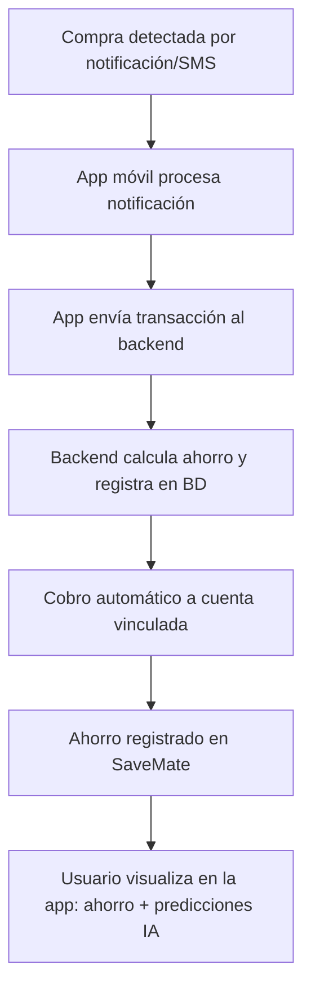

# 💰 SaveMate – Tu asistente de ahorro inteligente

SaveMate es una app móvil (Android/iOS) que transforma los gastos diarios pequeños (☕ cafés, 🍫 snacks, 🚌 transporte) en ahorro automático mediante redondeo o porcentaje configurable.

La app detecta las transacciones a partir de notificaciones y SMS bancarios, procesa el redondeo o porcentaje definido y realiza un cobro automático a la cuenta de origen para apartar el ahorro en una alcancía digital dentro de SaveMate.

Además, incorpora IA generativa que predice gastos probables y sugiere configuraciones óptimas para que el usuario alcance sus metas más rápido.

---

## 🔎 Problema identificado

❌ Los usuarios no logran ahorrar porque no llevan control de los gastos pequeños.  
❌ El dinero “desaparece” al final del mes sin claridad en qué se gastó.  
❌ Ahorrar manualmente requiere disciplina y constancia, algo difícil de mantener.

---

## 💡 Propuesta de valor

- 💵 Ahorro automático inteligente, ligado directamente al consumo real ⚡ (MVP)
- 🎯 Metas personalizadas ⚡ (MVP)
- 🤖 IA predictiva y generativa para anticipar gastos y recomendar ajustes ⚡ (MVP)
- 👥 Metas colaborativas (futuro)
- 🎮 Gamificación y logros (futuro)
- 📚 Educación financiera ligera (futuro)

---

## ⚙️ Mecánica de funcionamiento

- **Detección de transacción** ⚡ (MVP)  
- **Cálculo del ahorro** ⚡ (MVP)  
- **Cobro automático** ⚡ (MVP)
- **Escenarios de saldo insuficiente** ⚡ (MVP)
  - Opción A: No se ahorra  
  - Opción B: Se registra como pendiente  
  - Opción C: Respeta saldo mínimo seguro

- **Visualización de ahorro y gastos** ⚡ (MVP)  
- **IA predictiva y generativa** ⚡ (MVP)

---

## 📌 Ejemplo práctico de redondeo

- **Pago realizado:** $15.200  
- **Redondeo al múltiplo superior:** $16.000  
- **Ahorro generado:** $800  

---

## 💰 Modelo de monetización

- Comisión del **2.5% del total ahorrado al final de cada mes** ⚡ (MVP)

**Ejemplo:** Si un usuario ahorra $200.000 → SaveMate cobra $5.000

---

## 🆕 Funcionalidades destacadas

### ⚡ MVP – Primera versión
- Ahorro automático (redondeo o porcentaje)
- Manejo de saldo insuficiente
- IA predictiva y generativa
- Visualización de gastos y ahorro acumulado
- Monetización por comisión mensual

### 🚀 Futuras mejoras
- 🎮 Recompensas y logros
- 👥 Metas colaborativas
- 📚 Educación financiera automatizada

---

## 🏗️ Arquitectura del proyecto

```
/savemate-backend      -> API REST en Spring Boot (gestión de datos, lógica de negocio y seguridad)
/savemate-mobile       -> App móvil Flutter (UI Android/iOS + integración con Telephony e IA)
```

### 📂 Estructura del backend (Java + Spring Boot)

```bash
src/main/java/savemate/
│
├── config/                  
│   ├── SecurityConfig.java ⚡            # Configuración de seguridad (WebSecurity)
│   ├── JwtAuthenticationFilter.java ⚡   # Filtro para validar tokens JWT
│   ├── JwtService.java ⚡                # Servicio de generación/validación de JWT
│   ├── CustomUserDetailsService.java ⚡  # Carga de usuarios para Spring Security
│   ├── WebConfig.java ⚡                 # Configuración CORS y MVC
│   └── JpaConfig.java ⚡                 # Configuración JPA/Hibernate
│
├── controller/              
│   ├── AuthController.java ⚡            # Login y Registro (JWT)
│   ├── UserController.java ⚡            # Gestión de perfil de usuario
│   ├── TransactionController.java ⚡     # Gestión de transacciones
│   ├── SavingController.java ⚡          # Gestión de metas de ahorro
│   ├── AIController.java ⚡              # Endpoints de IA (Recomendaciones)
│   └── HealthController.java ⚡          # Check de estado del servicio
│
├── dto/                     
│   ├── UserDTO.java ⚡
│   ├── TransactionDTO.java ⚡
│   ├── TransactionSummaryDTO.java ⚡
│   ├── SavingDTO.java ⚡
│   ├── SavingSummaryDTO.java ⚡
│   ├── AIRecommendationDTO.java ⚡
│   └── AIRecommendationSummaryDTO.java ⚡
│
├── model/                   
│   ├── User.java ⚡                      # Entidad Usuario
│   ├── Transaction.java ⚡               # Entidad Transacción
│   ├── SavingGoal.java ⚡                # Entidad Meta de Ahorro
│   └── AIRecommendation.java ⚡          # Entidad Recomendación IA
│
├── repository/              
│   ├── UserRepository.java ⚡
│   ├── TransactionRepository.java ⚡
│   ├── SavingRepository.java ⚡
│   └── AIRecommendationRepository.java ⚡
│
├── service/                 
│   ├── UserService.java ⚡
│   ├── TransactionService.java ⚡
│   ├── SavingService.java ⚡
│   └── AIService.java ⚡                 # Lógica de negocio para IA
│
├── util/                    
│   ├── RoundingUtils.java ⚡             # Lógica de redondeo
│   └── NotificationParserUtils.java ⚡   # Parsing de SMS/Notificaciones
│
└── SaveMateApplication.java ⚡           # Clase principal (Main)

src/main/resources/
│
├── application.properties ⚡             # Configuración DB, JWT y Servidor
└── logback-spring.xml ⚡                 # Configuración de Logging
```

### 📱 App móvil (Flutter)

```bash
lib/
│
├── main.dart ⚡                          # Punto de entrada de la App
├── screens/
│   ├── login_screen.dart ⚡              # Pantalla de Inicio de Sesión
│   ├── register_screen.dart ⚡           # Pantalla de Registro
│   ├── home_screen.dart ⚡               # Dashboard principal
│   ├── transactions_screen.dart ⚡       # Historial de transacciones
│   ├── savings_screen.dart ⚡            # Gestión de metas de ahorro
│   ├── profile_screen.dart ⚡            # Perfil de usuario
│   └── ai_recommendations_screen.dart ⚡ # Pantalla de consejos de IA
│
├── widgets/
│   ├── transaction_card.dart ⚡          # Tarjeta de transacción
│   ├── saving_goal_card.dart ⚡          # Tarjeta de meta de ahorro
│   └── ai_tip_card.dart ⚡               # Tarjeta de consejo IA
│
├── services/
│   ├── api_service.dart ⚡               # Cliente HTTP base
│   ├── auth_service.dart ⚡              # Servicio de autenticación
│   └── notification_service.dart ⚡      # Gestión de notificaciones locales
│
├── models/
│   ├── user.dart ⚡
│   ├── transaction.dart ⚡
│   ├── saving.dart ⚡
│   └── ai_recommendation.dart ⚡
│
└── Telephony/                            # Módulo nativo personalizado (Android/iOS)
```

---

## 📊 Diagrama de flujo simplificado



---

# 🛠️ Tecnologías utilizadas

## Backend
- ☕ **Java 17**
- 🌱 **Spring Boot 3**
- 🗂️ **Spring Data JPA**
- 🔐 **Spring Security + JWT**
- 🛢️ **MySQL / H2**

## Móvil
- 📱 **Flutter**
- 🔌 **Dio / HTTP**
- 💾 **SharedPreferences / Secure Storage**
- 📨 **Telephony Plugin**

---

## ⚡ Instalación y ejecución local

### 📥 Clonar repositorio
```bash
git clone https://github.com/manuelsuarez07/safemate-ieti-2025.git
```

### ▶️ Ejecutar el backend
```bash
cd SafeMate-IETI-2025-2.2/savemate-backend
mvn clean install
mvn spring-boot:run
```

### ▶️ Ejecutar la app móvil
```bash
cd SafeMate-IETI-2025-2.2/savemate-mobile
flutter pub get
flutter run
```

---

# 📡 Endpoints principales

## 🔐 Autenticación
- **POST /auth/register** → Registrar usuario  
- **POST /auth/login** → Obtener token  

## 👥 Usuarios
- **GET /api/users/me**
- **PUT /api/users/{id}**

## 🧾 Transacciones
- **POST /api/transactions**
- **GET /api/transactions/user/{userId}**

## 🎯 Metas de ahorro
- **POST /api/savings**
- **GET /api/savings/user/{userId}**

## 🤖 Inteligencia Artificial
- **GET /api/ai/recommendations/user/{userId}**

---

# 👨‍💻 Equipo
- **Manuel Suárez**
- **Yeltzyn Sierra**
- **Cristian Zeballos**
